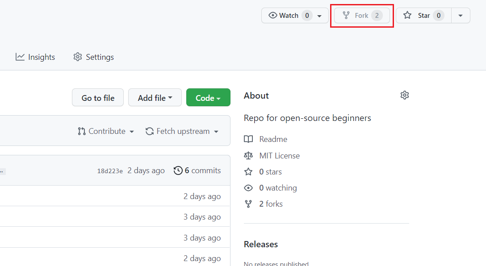
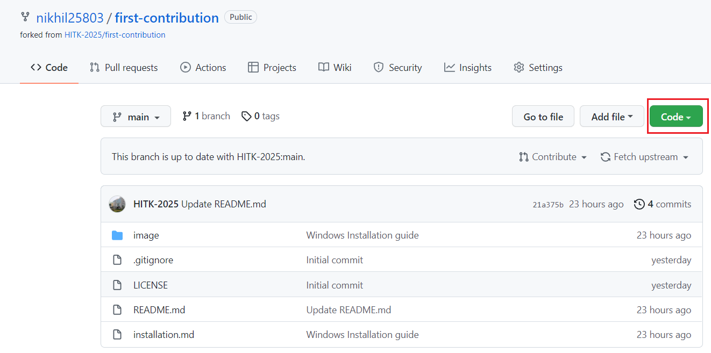
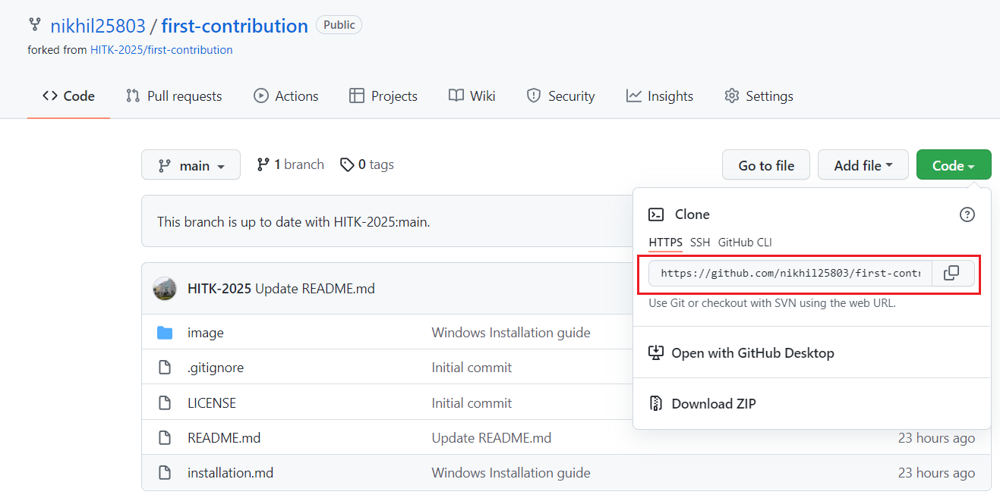
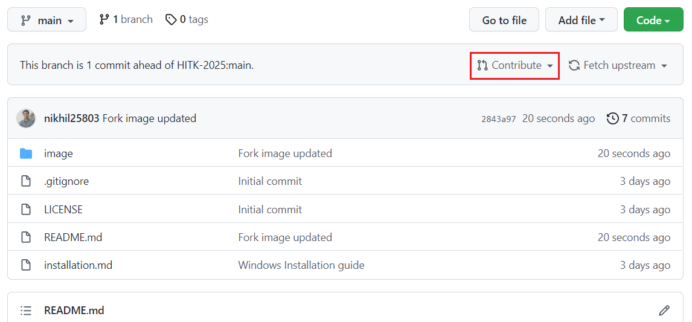
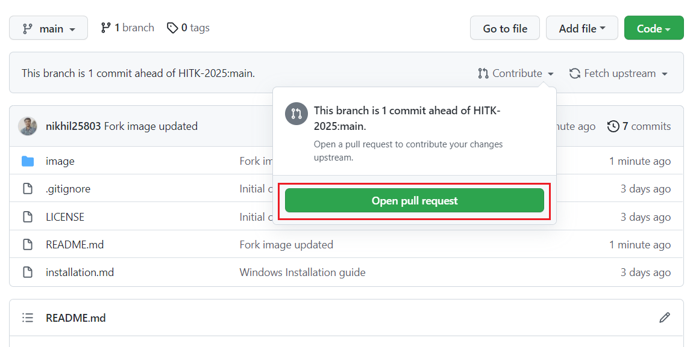
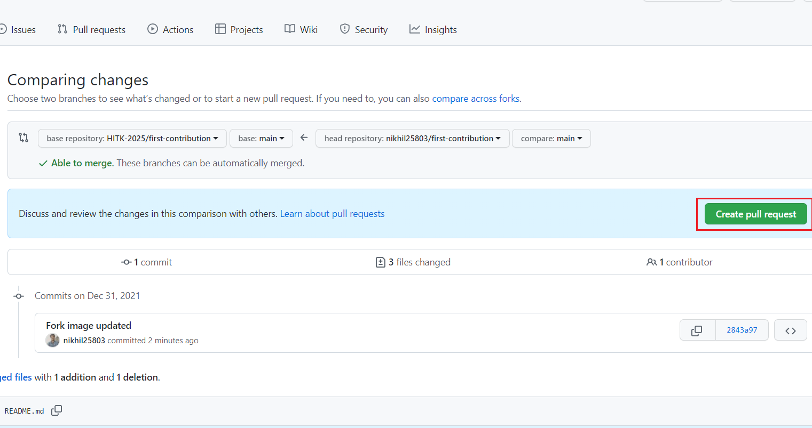
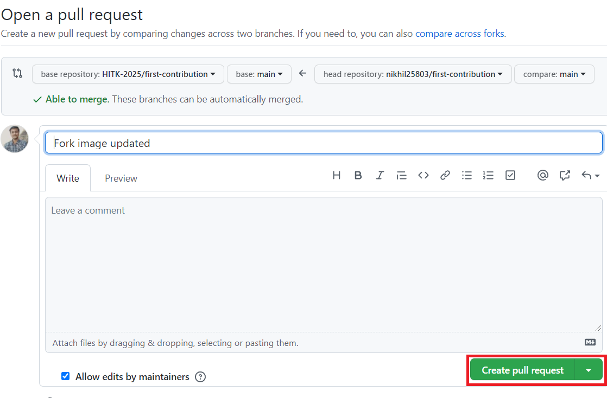
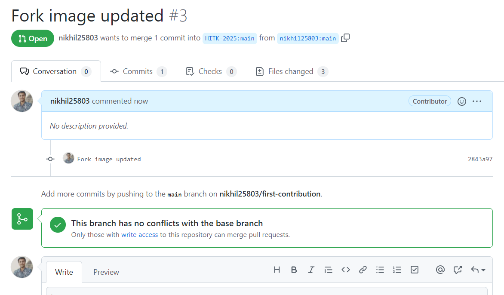
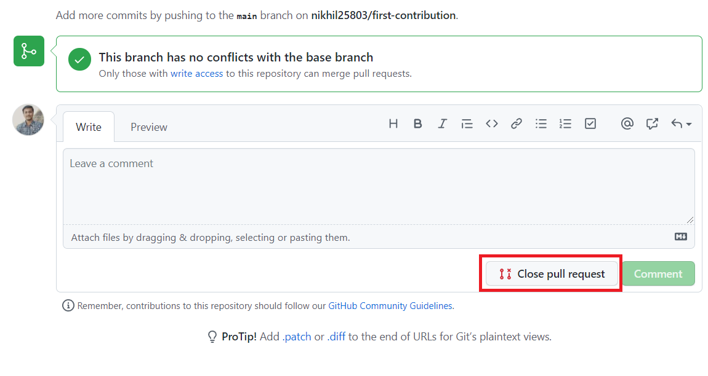

# First Contribution
<p>This project is for those who are new to open-source and looking for make their first contribution.<p>
<p>Follow the steps below :- </p>

_If you don't have GIT installed, [refer this tutorial](https://github.com/HITK-2025/first-contribution/blob/main/installation.md)_


***

# Git Setup Guide

## 1. Configure your local Git
```bash
git config --global user.name "github_username"
```

```bash
git config --global user.email "email_address"
```

## 2.  Go to the repository you want to contribute and Fork it.
* A fork is a rough copy of a repository. Forking a repository allows you to freely test and debug with changes without affecting the original project. One of the excessive use of forking is to propose changes for bug fixing.

  

* Click on Code Button and copy the URL of your forked Repository

  

  

## 3. Switch to your GitBash window, and enter the following :

* Clone the Forked project on your local system 

```bash
git clone repository_url
```

* Add origin URL
```bash
git remote add origin reo_url
```

* Make the change in the project you want !

## 4. Creating a Pull request
### Create a branch

* A branch is designed to encapsulate a group of changes. These changes might be thrown away, entirely rewritten or in the majority of cases they’ll be promoted into the main history of the codebase - via a merge.


* Creating a branch

```bash
git branch branch_name
```

* Checkout to the created branch

```bash
git checkout branch_name
```


* Now add the files using the git command

```bash
git add .
```
* Commit the changes to the local project

```bash
git commit -m "Changes_you_made"
```

* Make a pull request using the command
```bash
git push origin branch_name
```

## 5. Final Steps
* Open your forked git repository, you will get a message like as shown in the figure (if not then refresh the page).
###  Click on "Contribute"

  

###  Now click on "Open pull request"

  

###  Click on "Create pull request"

  

###  Click on "Create pull request"
 You may add a Comment to your Pull Request

  

### You will get  message similar to as shown below in the picture which means that you have sucessfully made a pull request !

  

### You may Close the pull request you made (for any possible reason).

  